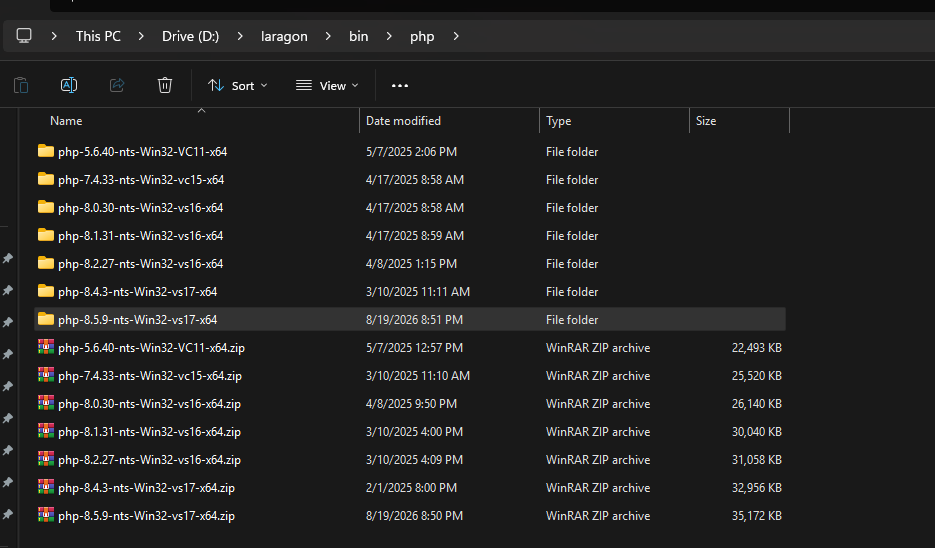
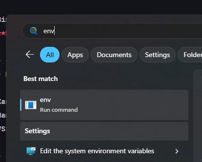
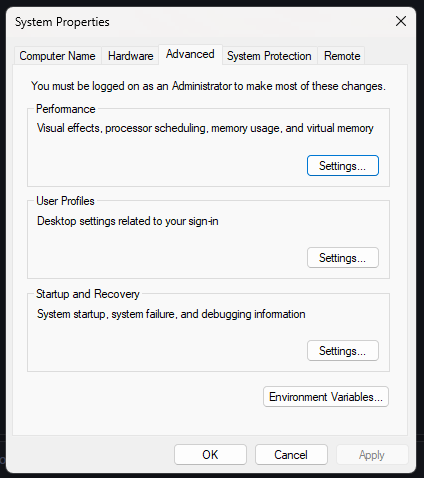
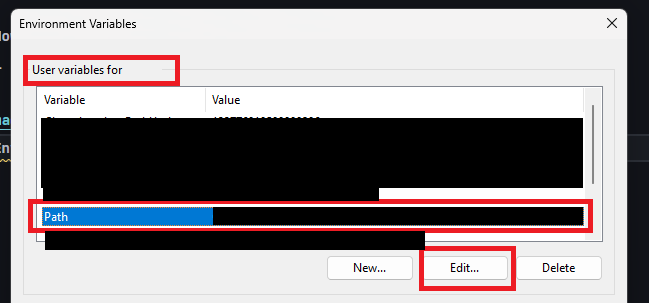
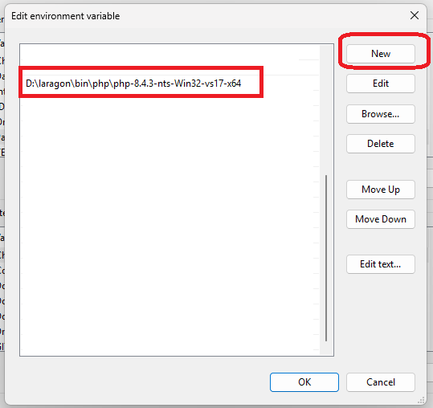
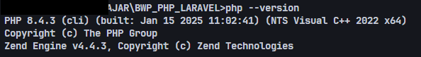

# Instalation

Bisa install salah satu dari 2 tools ini:
**Disarankan pakai yang diatas (laragon)**

- <https://github.com/leokhoa/laragon/releases/tag/6.0.0>
- KURANG DISARANKAN!!! RIBET!!! <https://www.apachefriends.org/download.html> 

Karena 2 tools ini gratis, dia tidak menyediakan php paling akhir
Nanti tinggal download latest php version lalu dimasukkan ke dalamnya, pakai versi yang 
`VS17 x64 Non Thread Safe`:

- <https://www.php.net/downloads.php?os=windows&osvariant=windows-downloads&version=8.5>

Setelah download tinggal di extract di misalnya D:\laragon\bin\php

## Daftarkan PHP ke env komputer

- Gunakan windows search, cari kata kunci `env`
- Tekan tombol `Edit the system environment variables`

- Pilih menu `Environment Variables`

- Pilih `PATH`, lalu pilih Menu `Edit`, *Hati-hati jangan sampai salah tekan tombol delete!!!*

- Tinggal `New`, lalu paste URL lokasi php mu ke sana

- Tinggal klik `Ok`,`Ok`,`Ok` sampai selesai

- Kalau sudah coba buka command prompt jalankan perintah `php --version`, sampai keluar contoh gambar dibawah

